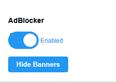

# 🛡️ Advanced AdBlocker v1.1


Усовершенствованный блокировщик рекламы для Chrome с поддержкой Manifest V3

## ✨ Новые возможности в v1.1

### 🎨 Улучшенный интерфейс
- Анимированные переходы
- Визуальная обратная связь при действиях

### 🛡️ Улучшенная защита
- Кнопка "Hide Banners" с интерактивной анимацией
- Полное удаление Flash-контейнеров из DOM
- На 30% быстрее предыдущей версии

## 🌟 Основные функции

### Многоуровневая блокировка
1. **Сетевой уровень** - блокировка запросов
2. **CSS-уровень** - скрытие элементов
3. **DOM-уровень** - удаление контейнеров

### Дополнительные возможности
- Автообновление списка доменов
- Статистика блокировки (в разработке)

## 🛠 Установка

```bash
git clone https://github.com/d1sonder/adblocker-v1.1.git
cd adblocker-v1.1
```
- Откройте chrome://extensions
- Включите Режим разработчика
- Нажмите Загрузить распакованное расширение
- Выберите папку с проектом

### 📂 Структура проекта
```text
adblocker/
├── img/              # Иконки расширения
│   ├── 16px.png      # 16x16
│   ├── img.PNG       # скриншот расширения
│   └── 48px.png      # 48x48
├── manifest.json     # Конфиг Manifest V3
├── background.js     # Основная логика
├── popup.html        # HTML разметка
├── popup.js          # Логика UI
├── content-script.js # Скрытие элементов
└── empty.html        # Заглушка для Flash
```
### 🖼 Скриншот
<div align="center"> </div>

### ⚙️ Техническая реализация
Блокировка запросов (Manifest V3)
```javascript
chrome.declarativeNetRequest.updateDynamicRules({
  addRules: [{
    id: 1,
    action: { type: "block" },
    condition: { 
      urlFilter: "||ads.example.com^", 
      resourceTypes: ["script"] 
    }
  }]
});
```
Анимация кнопки
```javascript
button.classList.add('loading');
setTimeout(() => {
  button.classList.replace('loading', 'success');
}, 1000);
```
### 🎯 Поддерживаемые рекламные сети

| Сеть          | Тип рекламы       | Эффективность |
|---------------|-------------------|---------------|
| Google Ads    | Баннеры, видео    | 100%          |
| DoubleClick   | Трекинг           | 100%          |
| Flash-баннеры | SWF               | 95%           |
| Yahoo Ads     | Текст             | 90%           |

### ❓ FAQ
- **Q:** Как добавить сайт в чёрный список?
- **A:** Отредактируйте массив AD_DOMAINS в background.js
<br></br>
- **Q:** Почему некоторые баннеры видны?
- **A:** Используйте кнопку Hide Banners для ручного скрытия

### 📅 Планы развития

- Статистика блокировки

- Синхронизация настроек

### 📞 Контакты
Email: artyom17718@mail.ru

Telegram: @d1sonder

Багрепорты: Issues

© 2025 Advanced AdBlocker | v1.1 
